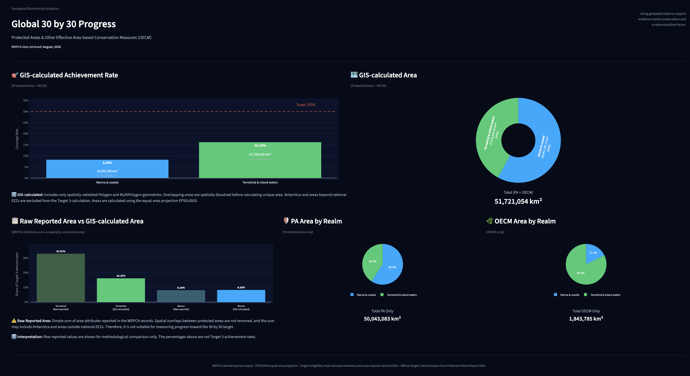
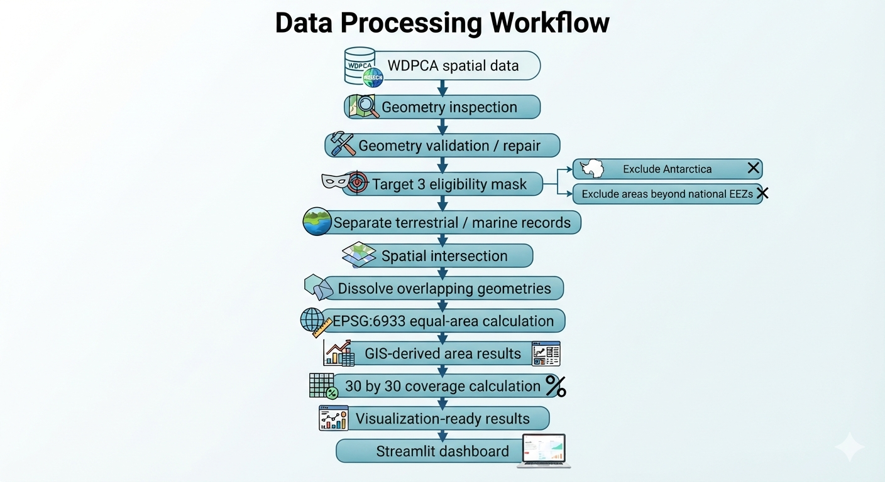

# Future Biodiversity & Protected Areas Dashboard

A geospatial data analysis project exploring global progress toward the **30 by 30 target** using protected area and OECM data from the **World Database on Protected and Conserved Areas (WDPCA)**.

The project combines geospatial data processing, spatial analysis, and data visualization to estimate the area of protected and conserved areas while accounting for spatial overlaps and Target 3 eligibility.

---

## Overview

The Kunming-Montreal Global Biodiversity Framework (GBF) Target 3 aims to ensure that at least **30% of terrestrial and inland water areas and 30% of marine and coastal areas** are effectively conserved by 2030.

This project asks:

> **How much of the eligible terrestrial and marine area is covered by Protected Areas (PAs) and Other Effective Area-Based Conservation Measures (OECMs)?**

Rather than simply summing area values reported in the source database, this project uses GIS-based spatial analysis to:

- validate and clean spatial geometries
- remove spatial overlaps
- distinguish terrestrial and marine areas
- exclude Antarctica
- exclude areas beyond national Exclusive Economic Zones (EEZs)
- calculate unique area using an equal-area projection
- compare the resulting coverage with the 30% Target 3 benchmark

The project is designed as a portfolio demonstrating the use of **Python, GeoPandas, spatial analysis, and data visualization for biodiversity and environmental applications**.

---

## Key Results

Using the current WDPCA dataset and the official Target 3 denominators from the *Protected Planet Report 2024*:

| Category | Realm | GIS-calculated coverage |
|---|---|---:|
| PA + OECM | Terrestrial & inland waters | **16.15%** |
| PA + OECM | Marine & coastal | **8.26%** |
| PA only | Terrestrial & inland waters | **15.14%** |
| PA only | Marine & coastal | **8.17%** |
| OECM only | Terrestrial & inland waters | **1.13%** |
| OECM only | Marine & coastal | **0.09%** |

WDPCA data retrieved: August, 2026
The Target 3 benchmark is **30% for each realm**.

These percentages are **GIS-derived results from the current WDPCA dataset** and should not be interpreted as official Protected Planet Target 3 achievement figures.

---

## Dashboard

The dashboard is available online:
**[Future Biodiversity & Protected Areas Dashboard](https://geospatial-biodiversity-analytics.streamlit.app/)**

The project includes an interactive Streamlit dashboard presenting:

- GIS-calculated achievement rate toward the 30% target
- GIS-calculated protected and conserved area
- comparison between Raw Reported Area and GIS-calculated Area
- Protected Area area by realm
- OECM area by realm

---

## Methodology

The analysis uses protected area and OECM spatial data from the **World Database on Protected and Conserved Areas (WDPCA)**, retrieved from Protected Planet.

### GIS-based area calculation

The GIS workflow consists of the following steps:

1. **Geometry validation**  
   Polygon and MultiPolygon geometries are validated and repaired where possible. Non-polygon and unusable geometries are excluded from area calculations.

2. **Spatial deduplication**  
   Overlapping protected areas and OECMs are spatially dissolved to calculate unique conserved area rather than summing overlapping records.

3. **Target 3 eligibility**  
   A Target 3 eligibility mask is applied to exclude **Antarctica** and areas beyond national **Exclusive Economic Zones (EEZs)**. The mask is based on the *Marine Regions Union of Country Boundaries and EEZs, Version 4 (2024)* dataset.

4. **Area calculation**  
   Areas are calculated using the global equal-area projection **EPSG:6933**.

The resulting GIS-calculated areas are used to estimate coverage toward the 30 by 30 target.

### GIS-calculated vs. Raw Reported Area

The dashboard presents two types of area values:

- **GIS-calculated Area** — spatially validated, overlap-dissolved, Target 3-eligible area calculated using EPSG:6933.
- **Raw Reported Area** — a simple sum of area attributes recorded in the WDPCA, without spatial overlap removal or Target 3 eligibility filtering.

Raw Reported Area is therefore provided for methodological comparison and is **not used to measure progress toward the 30 by 30 target**.

### Target 3 denominators

The coverage estimates use the official denominators from the **Protected Planet Report 2024 Target 3 methodology**:

| Realm | Denominator |
|---|---:|
| Terrestrial & inland waters | **134.53 million km²** |
| Marine & coastal | **363.0 million km²** |

The project uses these official denominators rather than independently deriving them from GIS.

---

## Data Processing Workflow

---

## How to Run

1. Create and activate the virtual environment:
2. Install dependencies:
3. Generate visualization-ready results:
4. Launch the Streamlit dashboard:
The dashboard will open in a local browser.

---

### Limitations
This project is a portfolio-scale GIS analysis and has several limitations.

### WDPCA data version
The analysis represents the WDPCA dataset available at the time of retrieval.
Protected and conserved area databases are continuously updated, so results may change as new records or revisions become available.

### Target 3 methodology
The project uses the official Protected Planet Report 2024 denominators but independently calculates the numerator from the current WDPCA spatial data.
Therefore, the resulting percentages should not be interpreted as official Protected Planet Target 3 statistics.

### Eligibility mask
The Target 3 eligibility mask uses the Marine Regions 2024 country-boundary and EEZ union dataset as a practical GIS mask.
It may not reproduce every detail of the official Protected Planet methodology, including differences in shoreline and boundary datasets.

### Spatial resolution and geometry quality
The accuracy of the GIS-derived area depends on the quality and spatial precision of the source geometries.

---

## Technologies
### Core & Frameworks
- **Python** (GeoPandas, Pandas, Shapely, Plotly)
- **Streamlit** (Web Application Framework)

### GIS & Data
- **GeoPackage** (Data Format)
- **EPSG:6933** (Equal-area projection)
- Spatial analysis / GIS concepts

---

## Data Sources
### Protected Planet
World Database on Protected and Conserved Areas (WDPCA)
[Protected Planet](https://www.protectedplanet.net/)

### Protected Planet Report 2024
Used as the source for the official Target 3 denominator methodology.
[Protected Planet Report 2024](https://digitalreport.protectedplanet.net/)

### Marine Regions
Flanders Marine Institute (2024).
Marine and land zones: the union of world country boundaries and EEZ's, Version 4.

---
## About the Project

This project was developed as part of a portfolio exploring how **geospatial data, computational methods, and environmental data can support biodiversity conservation and evidence-based environmental decision-making.**

The project builds on more than a decade of experience working with **OpenStreetMap, humanitarian mapping, and geospatial data**, while developing further skills in Python-based spatial analysis and environmental data science.

---

## Future Work

The current version focuses on global 30 by 30 analysis.
Potential future development includes:
- regional analysis
- integration of Earth observation datasets
- ecosystem condition and degradation analysis
- habitat and species distribution modelling
- analysis of relationships between ecosystem change and protected-area coverage
- more advanced environmental monitoring using remote sensing data

These extensions could support future research into evidence-based protected-area design and biodiversity conservation policy.

---

## Author
[Ayame Otsuki](https://github.com/AyameO)